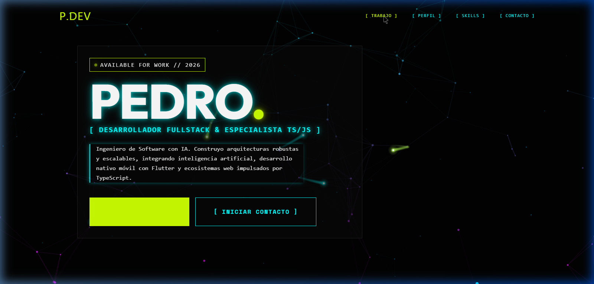
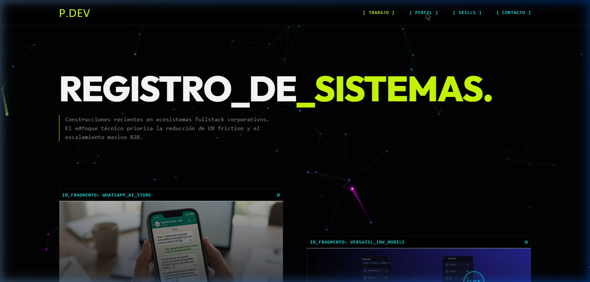
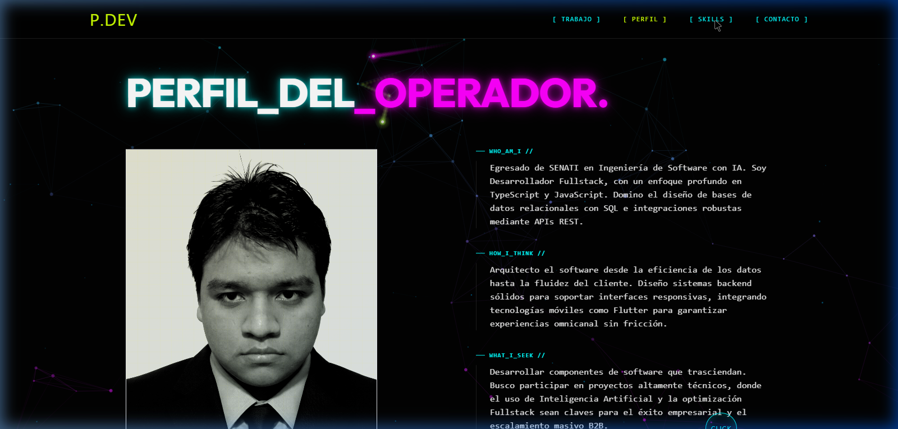

<p align="center">
  
</p>

<h1 align="center">⚡ PEDRO.DEV — Portafolio de Ingeniería de Software</h1>

<p align="center">
  
  
  
  
  
  
</p>

<p align="center">
  <strong>Portafolio web profesional con estética cyberpunk, motor de red neuronal en Canvas 2D nativo y animaciones cinematográficas GSAP.</strong>
</p>

---

## 📋 Descripción

Portafolio personal de **Pedro BG** — Ingeniero de Software con enfoque en IA, desarrollo Fullstack TypeScript/JavaScript, y arquitecturas nativas móviles con Flutter. Este proyecto implementa una experiencia web inmersiva e interactiva que combina:

- **Motor de red neuronal 2D** renderizado en HTML5 Canvas con sistema de profundidad dual, pulsos de luz BFS, y reactividad al mouse.
- **Animaciones cinematográficas** con GSAP ScrollTrigger y micro-interacciones de alto rendimiento.
- **Diseño cyberpunk neo-brutal** con paleta de colores neón (Cyan, Magenta, Lime) y tipografía monoespaciada.

---

## 🖥️ Preview

<p align="center">
  
  
</p>

---

## 🏗️ Arquitectura del Proyecto

```
PedroTI/
├── public/                     # Assets estáticos
│   ├── ai-agents.png           # Proyecto: WhatsApp AI Store
│   ├── inv.jpeg                # Proyecto: VersatilINV Mobile
│   ├── saas.png                # Proyecto: SaaS B2B
│   ├── mcp2.png                # Proyecto: MCP Roblox
│   ├── foto.png                # Foto de perfil
│   ├── favicon.svg             # Favicon SVG
│   └── icons.svg               # Sprite de íconos
├── docs/                       # Documentación y previews
│   ├── preview-hero.png
│   ├── preview-profile.png
│   └── preview-skills.png
├── src/
│   ├── main.jsx                # Entry point React
│   ├── App.jsx                 # Orquestador principal + datos de proyectos
│   ├── index.css               # Design system global (variables, neon glows)
│   ├── App.css                 # Estilos complementarios
│   ├── components/
│   │   ├── NeuralNetworkCanvas.jsx   # ★ Motor Canvas 2D neural engine
│   │   ├── HeroSection.jsx           # Hero con CTA y badge
│   │   ├── ProjectCard.jsx           # Tarjeta de proyecto con métricas
│   │   ├── AboutSection.jsx          # Perfil del operador
│   │   └── ContactSection.jsx        # Formulario EmailJS + WhatsApp
│   └── data/                         # Datos estáticos
├── index.html                  # HTML entry point
├── vite.config.js              # Configuración Vite
├── tailwind.config.js          # Configuración TailwindCSS
├── postcss.config.js           # PostCSS pipeline
└── package.json                # Dependencias y scripts
```

---

## 🧠 Motor de Red Neuronal — `NeuralNetworkCanvas.jsx`

El componente central del portafolio. Un engine de visualización de grafos en tiempo real implementado sobre **HTML5 Canvas 2D** nativo, sin dependencias de WebGL ni Three.js.

### Características Técnicas

| Feature | Implementación |
|---|---|
| **Sistema de Profundidad Dual** | Dos capas de nodos (foreground/background) con opacidades, radios y velocidades diferenciadas |
| **Movimiento Orgánico** | Drift sinusoidal (combinación de `sin` + `cos` con fases y frecuencias únicas por nodo) |
| **Gradiente de Color Dinámico** | Interpolación `Cyan → Magenta` basada en posición Y del viewport |
| **Pulsos de Luz BFS** | Pathfinding por grafos con trail radial gradient (bloom emulado) |
| **Spawn Múltiple** | Pulsos por scroll (velocidad acoplada), pulsos ambientales periódicos (~2s) |
| **Colores Multi-pulso** | Selección aleatoria entre Cyan, Magenta y Lime por cada pulso |
| **Interactividad Mouse** | Nodos cercanos al cursor escalan y brillan con glow radial dinámico |
| **HiDPI Support** | Canvas renderiza a `devicePixelRatio` nativo (retina ready) |
| **Performance** | Optimizado para 60FPS constantes — sin reflows, sin GC pressure |

### Pipeline de Renderizado (por frame)

```
1. clearRect()           → Limpia canvas con transparencia
2. Physics Update        → Drift sinusoidal + wrap de bordes
3. Mouse Proximity       → Cálculo de factores de interactividad
4. Deep Layer Lines      → Conexiones de capa de fondo (α ≤ 0.12)
5. Deep Layer Nodes      → Nodos de fondo con pulsación sutil
6. Foreground Lines      → Conexiones principales con color interpolado
7. Foreground Nodes      → Nodos con glow reactivo al mouse
8. Pulse Engine          → Trail + bloom head para cada pulso activo
```

---

## 🎨 Design System

### Paleta de Colores

| Token | Hex | Uso |
|---|---|---|
| `--color-bg` | `#020202` | Fondo base |
| `--color-accent-1` | `#CCFF00` | Neon Lime — CTAs, badges, acentos primarios |
| `--color-accent-2` | `#00FFFF` | Neon Cyan — Links, bordes, red neuronal |
| `--color-accent-3` | `#FF00FF` | Neon Magenta — Acentos secundarios, glitch |
| `--color-text` | `#EAEAEA` | Texto principal |
| `--color-muted` | `#8A8A8A` | Texto secundario |

### Tipografía

| Uso | Fuente | Peso |
|---|---|---|
| Display / Headings | **Outfit** | 800–900 |
| Body / Code / Labels | **Space Mono** | 400–700 |

### Efectos Visuales

- **Neon Glow** — `text-shadow` multi-capa con falloff (`10px → 20px → 30px`)
- **Cyber Box** — Borde semi-transparente + fondo `rgba(10,10,10,0.5)` sin blur
- **Cursor Personalizado** — 8px dot → 56px ring con label contextual (CLICK/VIEW)
- **Glitch Text** — `clip-path` animado con doble `::before`/`::after` pseudo-elements

---

## ⚙️ Stack Tecnológico

| Capa | Tecnología | Propósito |
|---|---|---|
| **Runtime** | React 19.2 | UI declarativa con hooks |
| **Build** | Vite 8.0 | Bundler ultrarrápido con HMR |
| **Animación** | GSAP 3.14 + ScrollTrigger | Animaciones de scroll cinematográficas |
| **Estilos** | TailwindCSS 3.4 + CSS Variables | Utilidades + design tokens |
| **Renderizado** | HTML5 Canvas 2D | Motor neural sin dependencias |
| **Email** | EmailJS | Envío de formulario de contacto |
| **Tipografía** | Google Fonts (Outfit, Space Mono) | Sistema tipográfico profesional |

---

## 🚀 Instalación y Desarrollo

### Prerequisitos

- **Node.js** ≥ 18.x
- **npm** ≥ 9.x

### Setup Local

```bash
# Clonar el repositorio
git clone https://github.com/PedroBG17/myport.git
cd myport

# Instalar dependencias
npm install

# Servidor de desarrollo (HMR)
npm run dev
```

El servidor se inicia en `http://localhost:5173`

### Build de Producción

```bash
# Generar bundle optimizado
npm run build

# Preview del build
npm run preview
```

---

## 📂 Proyectos Destacados

| Proyecto | Descripción | Stack | Repo |
|---|---|---|---|
| **WhatsApp AI Store** | Tienda online con agente de ventas AI vía WhatsApp | Next.js, Gemini API, Prisma, WhatsApp Web.js | [GitHub](https://github.com/PedroDEvP/Tienda-online-con-whatsapp-y-agente-ai-) |
| **VersatilINV Mobile** | App de inventario empresarial nativa | Flutter, Dio, SQLite, Express, SQL Server | [GitHub](https://github.com/PedroDEvP/App-Movil-VersatilINV) |
| **Proyecto SaaS B2B** | Plataforma SaaS multitenant con métricas | Node.js, React, Stripe, JWT | [GitHub](https://github.com/PedroDEvP/Proyecto-SAAS) |
| **MCP Roblox Studio** | Motor de producción AAA con 40+ herramientas | MCP Server, Luau, Procedural Gen | [GitHub](https://github.com/PedroDEvP/MCP-Roblox-studio) |

---

## 📬 Contacto

- **Email**: darkpedro020@gmail.com
- **WhatsApp**: [+51 932 833 777](https://wa.me/51932833777)
- **GitHub**: [PedroBG17](https://github.com/PedroBG17)

---

<p align="center">
  <code>OPERADOR_ACTIVO: PEDRO.DEV © 2026 // SISTEMA_INICIALIZADO</code>
</p>
